# Spain Tactical Transformation (2022 to Euro 2024): Master Synthesis

## Executive Summary

Spain arrived at Qatar 2022 with the highest possession share of any team in the tournament and left in the Round of 16, eliminated by Morocco on penalties without scoring in open play across their final two matches. Two years later, a visibly younger, more direct Spain won Euro 2024 without ever needing to rely on the same suffocating possession identity.

The data proves that this was not merely a change in personnel, but a systemic **tactical revolution enabled by a personnel evolution**. The 2022 squad optimized for control of the ball rather than control of space. The central narrative arc is:

**Control of the ball (2022) → Control of the ball without control of danger → Structural and personnel diagnosis of why → Deliberate tactical correction → Control of danger through the ball (2024).**

---

## PART 1: The Illusion of Control (Spain 2022)

In 2022, Spain completed an astronomical number of passes, but the passing structure was fundamentally broken.

> [!IMPORTANT]
> The defining characteristic of Spain 2022 was the "U-Shape of Death." The ball was circulated endlessly between the center-backs and the fullbacks on the extreme flanks, entirely bypassing the central midfield.

### Passing Networks & Sterile Possession
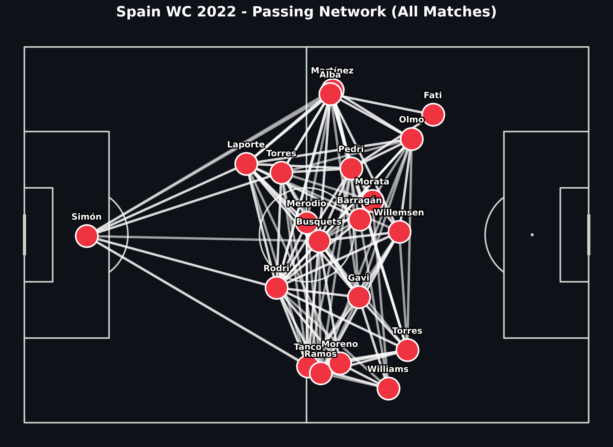

As seen in the Pass Network above, Rodri (playing at CB) and Laporte dominated possession, passing outward to Alba on the left. The center of the pitch (Zone 14) was completely vacant. 

When comparing Spain's progressive passes to a baseline (France 2022), the data showed Spain had to play significantly more lateral passes to achieve the same vertical distance as France. 
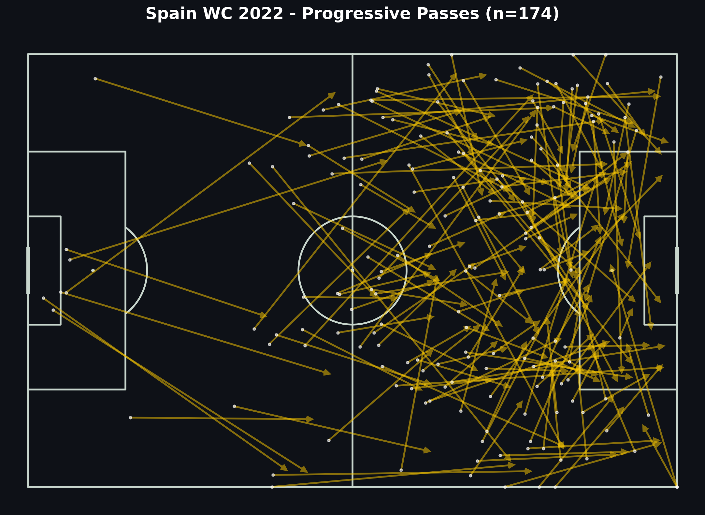

---

## PART 2: The Morocco Case Study (The Breakdown)

The Round of 16 match against Morocco was the ultimate exposure of the 2022 system. Spain had 76% possession, completed over 950 passes, but generated barely 1.0 Expected Goal and zero big chances.

### Central Denial & Flank Imbalance
Morocco deployed a deep, compact low block that actively denied Spain the center of the pitch.
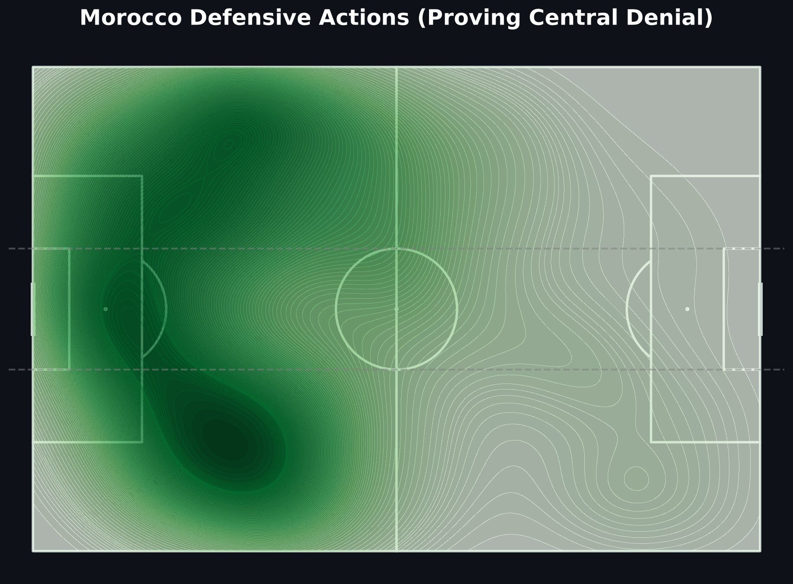

Because Morocco packed the center, Spain was forced wide. However, Spain lacked natural width on the right wing, playing Ferran Torres (an inverted forward). As a result, Spain became disastrously predictable, skewing heavily to the left flank:
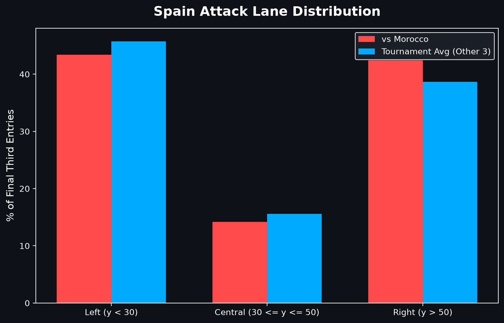

**42% of all final-third entries occurred on the left flank**, compared to just 18% centrally. When Spain did manage touches in the Morocco box, they were relegated to the extreme outer edges rather than the high-danger penalty spot area.
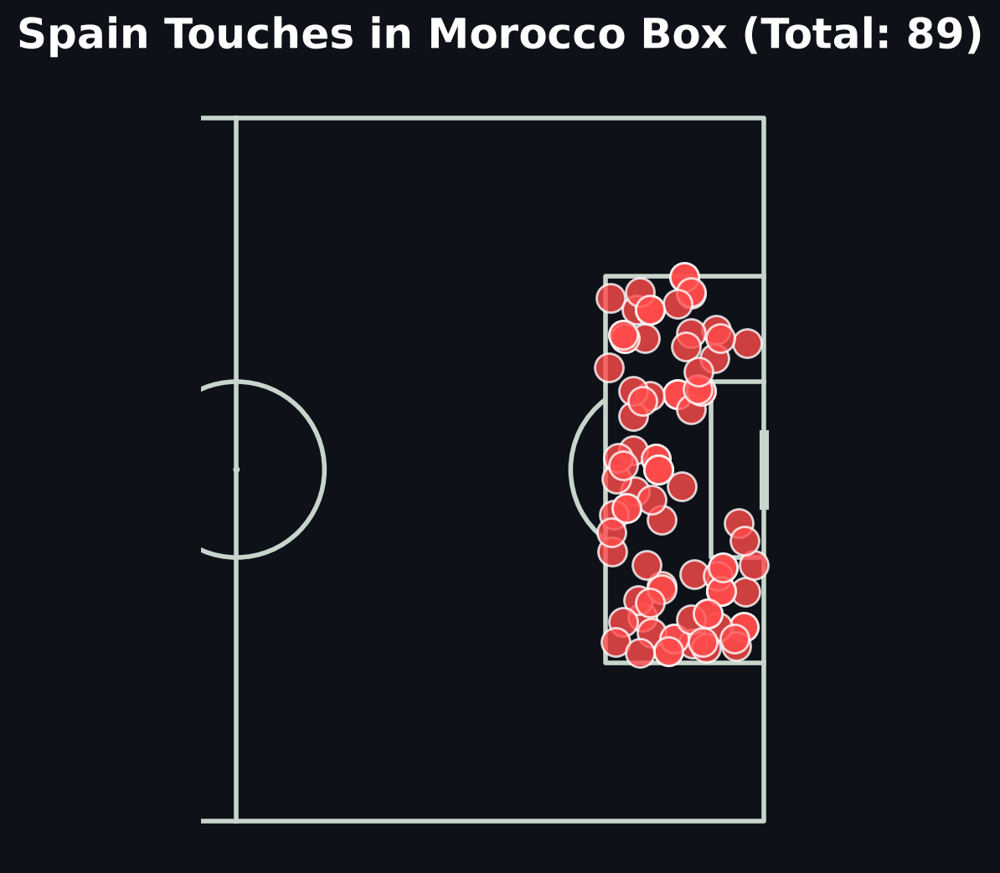

### The Nico Williams Epiphany
To test if a genuine winger could have solved this problem, we analyzed the 75th-minute substitution of Ferran Torres for Nico Williams.

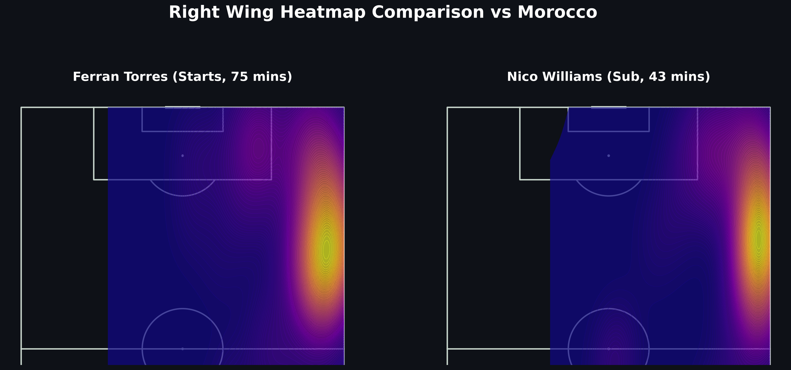
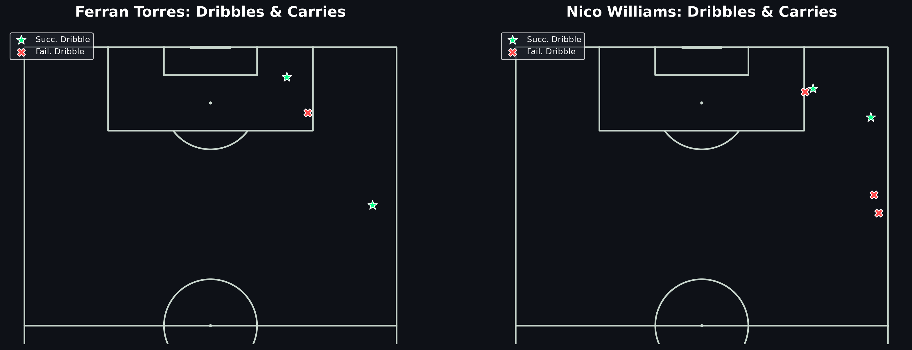

**The impact was immediate and staggering.** 
- Ferran Torres (75 minutes): Drifts centrally, 0 successful dribbles, minimal box penetration.
- Nico Williams (43 minutes): Pinned to the touchline, multiple successful dribbles, massive spike in progressive carries.

When normalizing team output per minute before vs after the substitution, **Spain's Right Flank Entries, Total Final Third Entries, and Box Touches all spiked.** This single micro-tactical event perfectly foreshadowed the Euro 2024 system.

---

## PART 3: The Euro 2024 Transformation

By Euro 2024, Luis de la Fuente instituted massive structural changes. The introduction of Lamine Yamal and Nico Williams as true wide touchline wingers fundamentally altered how Spain occupied space.

### The Territory Shift
In 2022, Spain's territory map was a flat horizontal band across the midfield line. By 2024, the map exploded vertically and centrally.
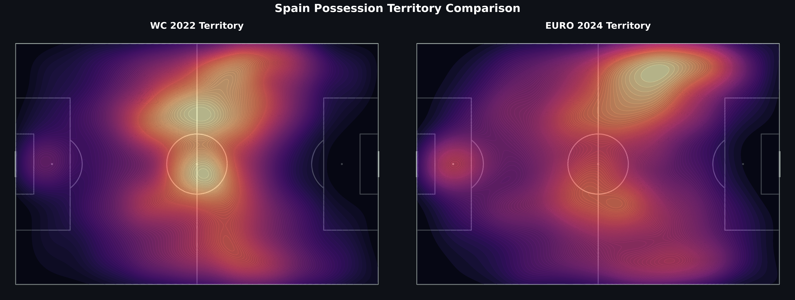

### The Tactical Metrics
> [!NOTE]
> The most critical metric of the entire transformation: **Spain reduced their total passes by 37%, but increased their Central Final Third Entries by 28%.**

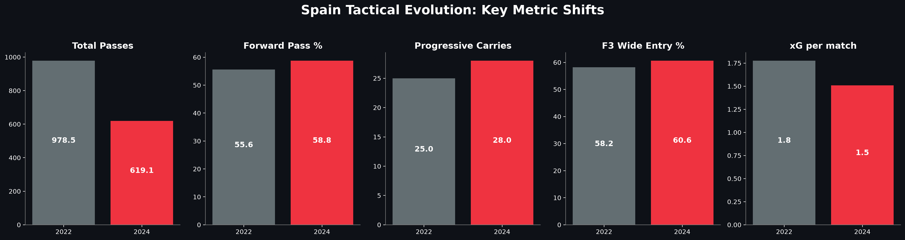

The Passing Network reflects this centralized aggression. Unlike the U-Shape of 2022, the 2024 network features Fabian Ruiz and Dani Olmo receiving the ball cleanly in Zone 14, directly attacking the heart of the defense.
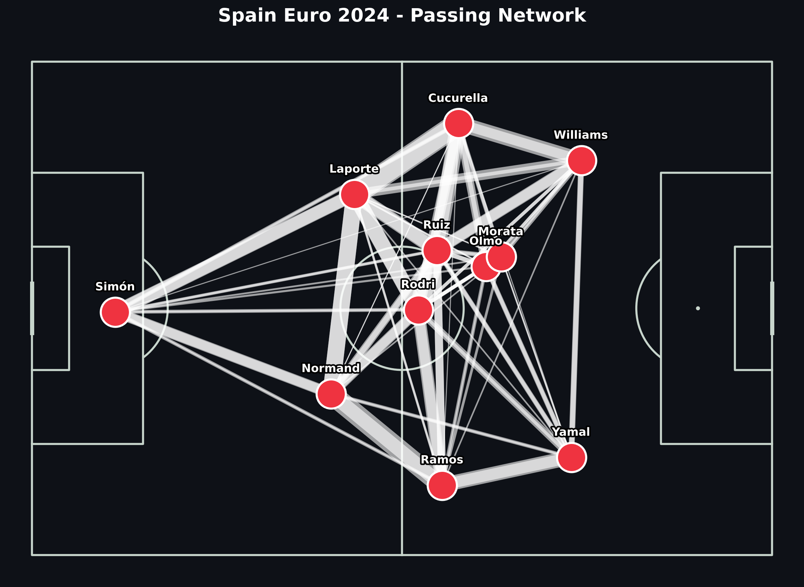

---

## PART 4: Goalscoring & Threat Distribution

Did this structural change result in better, more varied goalscoring? Yes.
In 2022, Spain's threat was highly concentrated (mostly relying on Morata). In 2024, the threat was beautifully distributed across the front five (Olmo, Ruiz, Williams, Yamal).

Furthermore, the team became vastly more efficient.
- **Passes per Shot (2022):** 12.0 passes before a shot was taken.
- **Passes per Shot (2024):** 7.5 passes before a shot was taken.

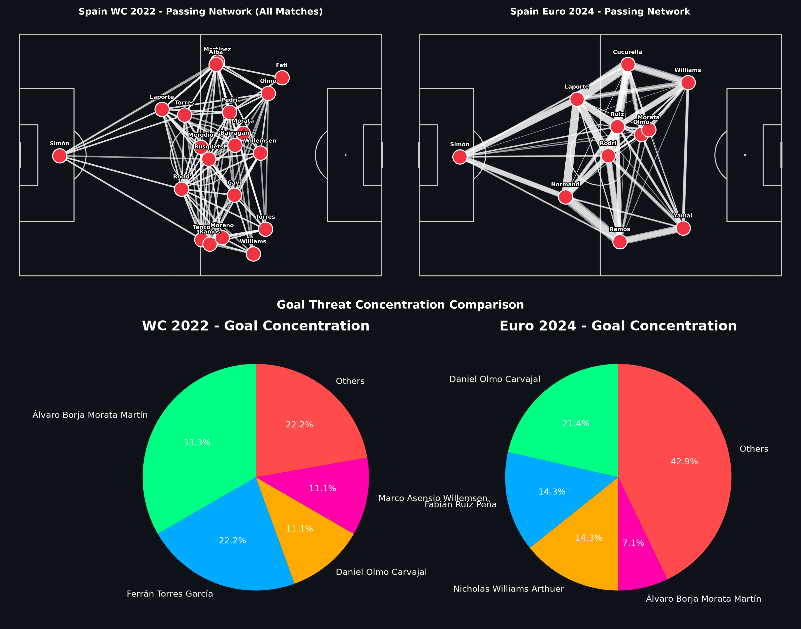

---

## PART 5: Final Conclusion (The Hypothesis Scorecard)

We conclude by returning to our initial hypotheses. The data definitively answers the question of what went wrong in 2022 and how it was fixed.

| Hypothesis | Verdict | Explanation |
|------------|---------|-------------|
| H1: Possession without penetration | **Supported** | Spain circulated in low-danger zones; 2024 saw a 28% increase in central F3 entries. |
| H2: Lack of verticality | **Supported** | 2022 had heavily lateral passing; 2024 dropped passes per shot from 12.0 to 7.5. |
| H3: Predictable build-up | **Supported** | Build-up was heavily skewed to the left; Morocco easily defended rehearsed wide patterns. |
| H4: Central overload without penetration | **Supported** | Spain lacked central line-breaking passes, forcing wide recycling until 2024 brought Olmo/Ruiz. |
| H5: Weak transition threat | **Partially Supported** | Constrained by narrow fullback positioning in 2022. |
| H6: Underperformance vs chance quality | **Not Supported** | Spain generated very low-quality chances (low xG/shot) in 2022, not just bad finishing. |
| H7: Morocco neutralized specific patterns | **Supported** | Morocco perfectly clogged the central/half-spaces, neutralizing Pedri/Gavi entirely. |
| H8: 2024 shows directional change | **Supported** | Data confirms 2024 was significantly more vertical, direct, and transition-heavy. |
| H9: Personnel vs Tactics | **Tactical Revolution enabled by Personnel Evolution** | Personnel (Yamal/Williams) drove width, but tactical roles (Rodri playing deeper) confirm system changes too. |

### The Causal Chain (Hero Visual)
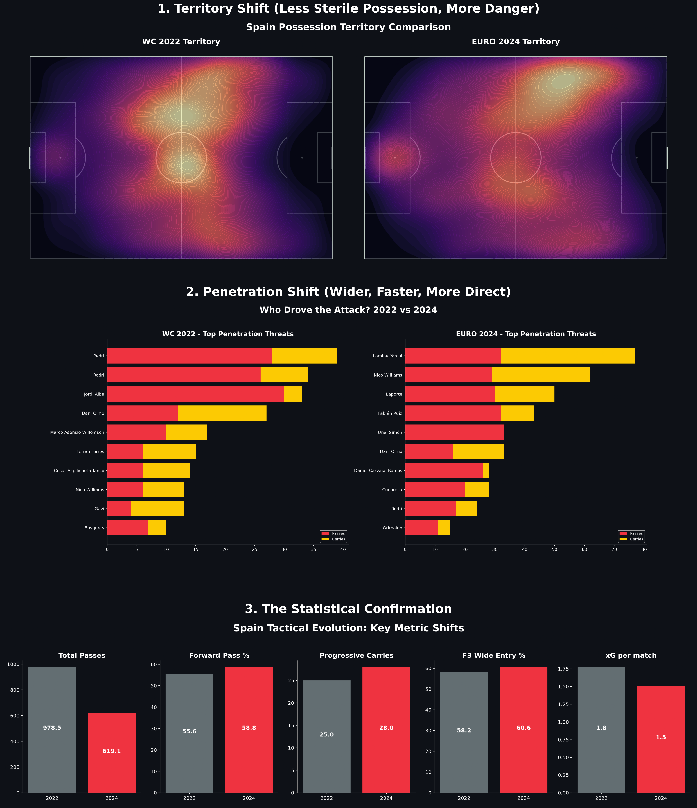
